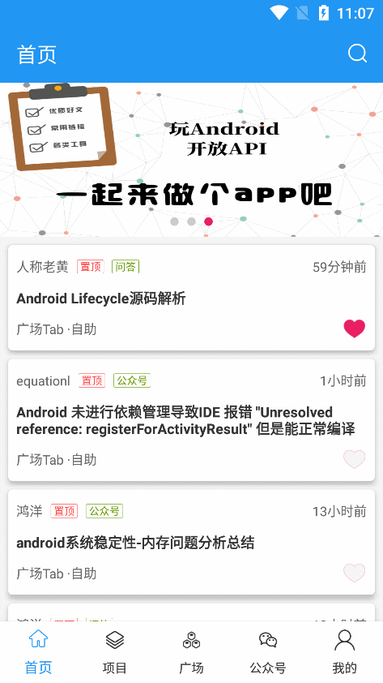

# kt+mvi+jetpack版 玩andorid

## 基于单向数据流和唯一数据源的MVI架构

- 以数据库数据作为唯一数据源
- 以用户`intent`作为数据流起点进行单向流动
  - 用户操作以`Intent`的形式通知`Model`
  - `Model`基于`Intent`更新`UiState`
  - `View`接收到`UiState`变化刷新UI

## 遵循[Android Architecture Components](https://developer.android.com/topic/libraries/architecture/)

- 界面层(UI Layer)
  - APP内实现：视图（Activity/Fragment等） + 数据驱动及处理逻辑的状态容器（ViewModel等）

- 网域层(Domain Layer) 可选项，用于处理复杂逻辑或支持可重用性吗，当你需要从不同数据源获取数据时如需要同时从数据库和接口请求数据时，推荐使用UseCase进行组合。
  - App内实现：组合或复用数据源（UseCase）

- 数据层(Data Layer)
  - App内实现：数据源（Repository）

## 演示（UI参考[JetpackMvvm](https://github.com/hegaojian/JetpackMvvm)）

## 包结构(参考[Android Architecture Components](https://developer.android.com/topic/architecture#recommended-app-arch))

- `data` 数据层
- `di` 依赖注入
- `domain` 连接`data`与`presentation`
- `presentation` 界面相关

## 版本控制

### v1.0.0

|                   功能             | 完成状态 |
| :---------------------------------| :------: |
| 首页列表、顶部广告                   | &#9745; |
| 用户输入文字搜索、热门搜索、历史记录   | &#9745; |
| 根据类别显示项目列表                 | &#9745; |
| 广场、每日一问、体系、导航            | &#9745; |
| 公众号文章列表                       | &#9745; |
| 文章详情                            | &#9745; |
| 我的、 我的收藏                      | &#9745; |
| 换皮肤                               | &#9744; |

## 参与贡献

1. [JetpackMvvm](https://github.com/hegaojian/JetpackMvvm)
2. [Android-Clean-Architecture-MVVM-Hilt-RX](https://github.com/ZahraHeydari/Android-Clean-Architecture-MVVM-Hilt-RX)
3. [wanandroid](https://github.com/hongyangAndroid/wanandroid)
4. [Android Architecture Components](https://developer.android.com/topic/architecture#recommended-app-arch)
